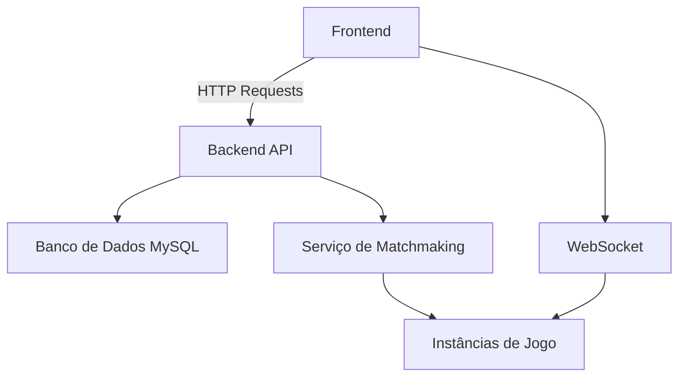

# 🌌 Nebula Conquest - Jogo de Estratégia Espacial 4X


Domine a galáxia neste épico jogo de estratégia espacial 4X (Explorar, Expandir, Explorar e Exterminar) onde cada decisão molda seu destino interestelar.

## 🚀 Recursos Principais

### 🌠 Experiência de Jogo Imersiva
- **Galáxia Procedural**: Sistemas estelares únicos gerados dinamicamente
- **Combates Táticos**: Sistema de batalha baseado em física realista
- **Diplomacia Complexa**: Alianças, traições e política interestelar

### 🛸 Progressão Profunda
- **Árvore Tecnológica**: 200+ tecnologias em 7 eras distintas
- **Customização de Naves**: 50+ módulos para criar frotas únicas
- **Sistema de Reputação**: Suas ações afetam como outras facções te veem

### 🌐 Multijogador Dinâmico
- **Guerras de Alianças**: Batalhas com até 100 jogadores simultâneos
- **Mercado Global**: Economia controlada pelos jogadores
- **Eventos Sazonais**: Desafios únicos com recompensas exclusivas

## 🖼️ Galeria

<div class="slick-carousel">
    
    
    
</div>

## 🛠️ Arquitetura do Projeto



### 📚 Stack Tecnológica

| Camada          | Tecnologias                                                                 |
|-----------------|-----------------------------------------------------------------------------|
| **Frontend**    | HTML5, Tailwind CSS, JavaScript, Slick Carousel                            |
| **Backend**     | Node.js, Express, MySQL                                                    |
| **Infra**       | Docker, AWS EC2, Redis                                                     |
| **Ferramentas** | ESLint, Prettier, GitHub Actions                                           |

## 👾 Personagens Jogáveis

<div class="grid grid-cols-1 md:grid-cols-4 gap-4">
    <div class="character-card">
        
        <h3>Comandante Zara</h3>
        <p>Especialista em táticas ofensivas</p>
        <div class="badge">Dano +15%</div>
    </div>
    
    <!-- Outros personagens... -->
</div>

## 🎮 Começando a Jogar

### Requisitos Mínimos
- Navegador moderno (Chrome, Firefox, Edge)
- Conexão de internet estável
- Conta gratuita no Nebula Conquest

### Instalação Local (Desenvolvedores)
```bash
git clone https://github.com/Policate22/nebula-conquest.git
cd nebula-conquest
npm install
npm start
```

## 📊 Métricas da Comunidade

| Estatística          | Valor        |
|----------------------|--------------|
| Jogadores Ativos     | 250,000+     |
| Partidas Diárias     | 50,000+      |
| Alianças Registradas | 12,000+      |
| Sistemas Explorados  | 8 Bilhões+   |

## 🤝 Como Contribuir

1. Faça um Fork do projeto
2. Crie sua Branch (`git checkout -b feature/AmazingFeature`)
3. Commit suas Mudanças (`git commit -m 'Add some AmazingFeature'`)
4. Push para a Branch (`git push origin feature/AmazingFeature`)
5. Abra um Pull Request

## 📡 Conecte-se

[](https://discord.gg/)
[](https://twitter.com/)
[](https://youtube.com/)

## 📜 Licença

Distribuído sob licença MIT. Veja `LICENSE` para mais informações.

---

**Desenvolvido com paixão espacial por [João Gabriel Policate](https://github.com/Policate22)**  
✨ "A galáxia é o limite... e nós o ultrapassamos!" ✨